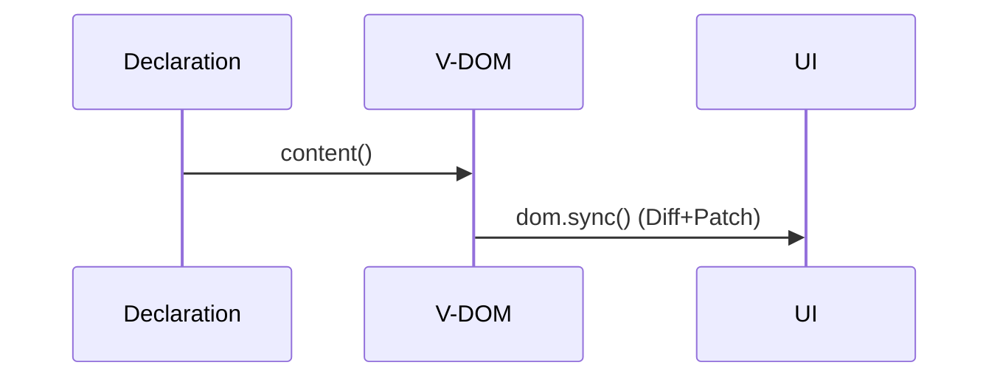
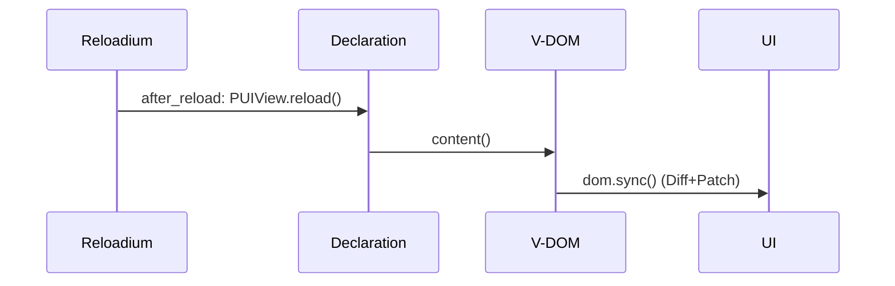
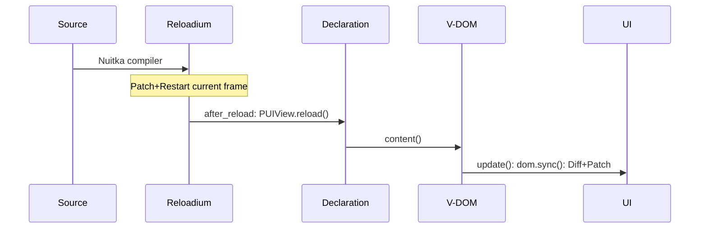

# Virtual DOM

```mermaid
sequenceDiagram
    participant Declaration
    participant V-DOM;
    participant UI;

    Declaration->>V-DOM: content()
    V-DOM->>UI: dom.sync() (Diff+Patch)
```

# Hot-Reload
## Use of Reloadium reload hook to trigger update

```mermaid
sequenceDiagram
    participant Reloadium
    participant Declaration
    participant V-DOM
    participant UI

    Reloadium->>Declaration: after_reload: PUIView.reload()
    Declaration->>V-DOM: content()
    V-DOM->>UI: dom.sync() (Diff+Patch)
```

## Reloadium patches Python frame, PUI patches UI Tree

```mermaid
sequenceDiagram
    participant Source
    participant Reloadium
    participant Declaration
    participant V-DOM
    participant UI

    Source->>Reloadium: Nuitka compiler
    note over Reloadium: Patch+Restart current frame
    Reloadium->>Declaration: after_reload: PUIView.reload()
    Declaration->>V-DOM: content()
    V-DOM->>UI: update(): dom.sync(): Diff+Patch
```
