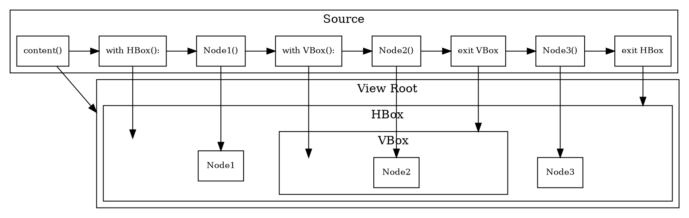

# Imperative -> Declarative
## View Root Searching
```python
def find_pui():
    import inspect
    from .view import PUIView
    frame = inspect.currentframe()
    while frame:
        views = [v for k,v in frame.f_locals.items() if isinstance(v, PUIView) and v.frames]
        if views:
            root = views[0]
            parent = root.frames[-1]
            return root, parent
        frame = frame.f_back
    else:
        raise RuntimeError("PUIView not found")
```

### View Root
```python
class PUIView(PUINode):
    def __init__(self):
        self.frames = []
        self.last_children = []
        super().__init__()

    def update(self):
        self.children = []
        try:
            with self as scope: # <- target for find_pui()
                self.content() # V-DOM builder
        except:
            # prevent crash in hot-reloading
            self.children = self.last_children
            import traceback
            traceback.print_exc()

        # DOM Sync
        sync(self, self.last_children, self.children)

        self.last_children = self.children
```

### V-DOM Node
```python
class PUINode():
    def __init__(self):
        if isinstance(self, PUIView):
            self.root = self
            self.parent = self
        else:
            self.root, self.parent = find_pui()

    def __enter__(self):
        self.root.frames.append(self)
        return self

    def __exit__(self, ex_type, value, traceback):
        self.root.frames.pop()
```

### Walk-through
#### Consider this source
```python
def content():
    with HBox():
        Node1()
        with VBox():
            Node2()
        Node3()
```
#### V-DOM construction


## State
To capture the usage of state in the view, we register listener in state getter and trigger update in state setter
## Take `StateList` as an example
```python
class StateList(BaseState):
    def __init__(self, values=None):
        self.__listeners = set()
        if values is None:
            self.__values = []
        else:
            self.__values = values

    def __getitem__(self, key):
        try:
            root, parent = find_pui()
            self.__listeners.add(root)
        except:
            pass
        return self.__values[key]

    def __setitem__(self, key, value):
        self.__values[key] = value
        for l in self.__listeners:
            l.update()
```
